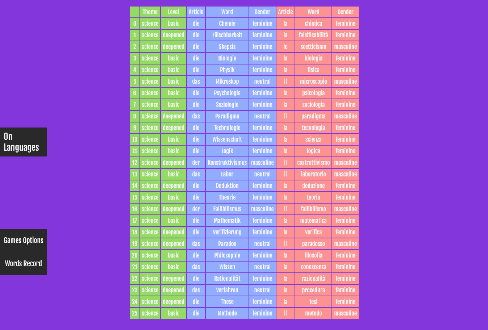

# On Language

About languages, vocabulary and fixation.

The project seeks to develop an application aimed at fixing vocabulary in at least 6 languages (English, French, German, Italian, Portuguese and Spanish).

With a minimalist interface, it seeks to be as intuitive as possible for the user.

## How start it?

First, you need to install or have already installed **Node.js** on your machine.

After that it is necessary to install all the **dependencies**.

For this, it is necessary at the prompt to go to the folder/directory where the files are and execute the following command:
> npm install

Then, after installing all the dependencies, to start the application, run::
> npm start

After that, the prompt will show the port the application is running on.

## Main Page

The homepage has:
* A button to redirect to the homepage;
* A button that redirects to Activity Options;
* A button to access the Word Record menu.

## Options

Options have:
* They allow choosing the type of activity to be developed;
* Choose primary language, the one the user wants to learn;
* The type of words the user wants to study;
* Vocabulary difficulty (basic or in-depth);
* Themes, subjects of interest to the user;
* A secondary language, which can be supportive or add to the challenge.
* Finally, the button to start the activity.

## Mutiple Choice

Here, a multiple-choice activity that, when correct, will only mark the answer in green, but when wrong, it will mark the answer in green, the user's answer in bright red, and the other alternatives only in red.
It also has buttons to navigate between questions (Next or Previous), as well as a button to resolve (Resolve) the question and another to mark (to create a new challenge with only the marked ones).

## Write the Translation

In this, we also seek to work with the articles so that the user is aware of the gender of the words, which, with the exception of English, can change from language to language.
This exercise, unlike the previous one, seeks to develop a more active study of the user who must write correctly, having the same buttons.

## Words Record

Accessed from the button 'Words Record', the registration part is also important, both for the possibility of consulting the user and for the importance of transparency about the decisions taken in each translation and classification.
First, there is a menu where the user can choose two languages, the word class, the level of complexity and the topic he wants to consult.

Then, it will show the list with the selected options, being possible to see the theme, the complexity, the reference article, the word and the genre that can be classified in the selected languages.

_________________________________
### To Improve:

This project is not finished, there are still some bugs to be fixed, activities to be implemented, a feedback interface, a mechanism to follow the performance of activities, among others...

* Set all css changes to styles instead scripts: by set and remove classes;
* Set the grammar choice to hide the themes;
* *Mutiple Choice Game*: Change Next Button and improve the Feedback;
* *Options*: Simplify code;
* *Memory Game*: Add border with colors to correct and wrong match;
* *Hangman Game*: Set the figure of hangman and create hint scheme;
* *Data-form*: Check and improve creation/ read/ update/ delete data;
* *game-Link*: link words and articles or words with his translation;
* *game-FlashCard*: create flash cards;
